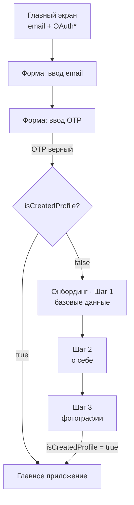

# Флоу авторизации и онбординга

Passwordless-флоу: **авторизация и регистрация — это одно и то же**. Нет отдельного «регистрироваться/войти» — пользователь всегда проходит один путь через почту + OTP, а дальше система сама решает, новый он или нет, по флагу профиля.

## Принципы

- Вход через **почту (email) + OTP**.
- **OAuth (Apple ID, Google ID)** — в планах на будущее, **не в MVP**.
- Авторизация = регистрация (единый вход).
- Новизна пользователя определяется флагом **`isCreatedProfile`**, а не фактом первого входа.

## Схема

## Экраны

### 1. Главный экран (Welcome)

- Вход через почту.
- (future) OAuth: Apple ID, Google ID.

### 2. Email + OTP

- Форма ввода **email**.
- Форма ввода **OTP-кода** (приходит на почту).
- При верном коде — пользователь авторизован (сессия/токен от бэкенда).

### 3. Развилка по `isCreatedProfile`

После авторизации проверяется флаг профиля:

- `true` → **главное приложение**;
- `false` / отсутствует → **онбординг** (создание профиля, 3 шага).

### 4. Онбординг — создание профиля (3 шага)

Рабочие имена шагов временные (`step_1` и т.д.) — назовём красиво позже.

**Шаг 1 — базовые данные (`step_1`)**

- Имя
- Пол (`MALE` / `FEMALE`)
- Дата рождения
- ~~Город~~ — **город руками не вводят.** Определяется по геолокации (reverse-geocode),
  переопределяется в настройках/при создании анкеты и запоминается. См.
  [geolocation.md](./geolocation.md).

**Шаг 2 — о себе**

- Интересы — выбор **от 1 до 5** из справочника (управляется через админку; фронт подгружает с бэка, не хардкодит)
- Знак зодиака — **вычисляется из даты рождения**; пользователь управляет только **тогглером «показывать знак зодиака»** в профиле (отдельного ввода/селекта нет)
- Описание — **30–1000 символов, обязательно**
- Вес, рост — **опционально**, с поддержкой региональных единиц (СИ в БД, конверсия на фронте — см. [units.md](./units.md))
- Цель знакомства — **enum** (фиксирован в коде/БД, не админка), селект из значений:

    | Ключ                     | Лейбл                  |
    | ------------------------ | ---------------------- |
    | `FRIENDSHIP`             | Friendship             |
    | `LONG_TERM_RELATIONSHIP` | Long-term relationship |
    | `DATES`                  | Dates                  |
    | `NOTHING_SERIOUS`        | Nothing serious        |

**Шаг 3 — фотографии**

- **До 5** фото, **минимум 2**

### 5. Завершение

После шага 3 → выставляется **`isCreatedProfile = true`** → переход в главное приложение.

## Открытые вопросы (TBD)

- **Прогресс онбординга** — можно ли возвращаться на шаг назад (частично заполненный профиль сохраняется: шаги идемпотентны, прогресс держится в `onboardingStep`).

### Решено

- **Имя поля флага** — `isCreatedProfile`.
- **Знак зодиака** — вычисляется из даты рождения; в UI только тоггл показа; в `Profile` с бэка не приходит.
- **Интересы** — **от 1 до 5**, из справочника, управляемого через админку (фронт подгружает с бэка).
- **Описание** — **обязательное, 30–1000 символов**.
- **Вес/рост** — храним в СИ (`float`), диапазоны рост **100–250 см**, вес **30–300 кг**; на фронте конверсия в региональные единицы (см. [units.md](./units.md)).
- **Цель знакомства** — фиксированный **enum**: `FRIENDSHIP`, `LONG_TERM_RELATIONSHIP`, `DATES`, `NOTHING_SERIOUS`.
- **Фото** — `multipart` (поле `photo`), `jpeg/png/webp`, ≤ 10 МБ, до 5 шт, минимум 2 на завершение; стораж за интерфейсом (локальная ФС в dev, S3-совместимое в prod).
- **OTP** — **6 цифр**, TTL 300с, кулдаун 60с, до 5 попыток ввода. В dev код всегда `000000`.

## Влияние на навигацию (предложение, не финал)

Естественно ложится в три зоны навигации:

- **Auth-стек** — Welcome → Email → OTP;
- **Onboarding-стек** — Step 1 → Step 2 → Step 3;
- **Main** — табы приложения.

Переключение между зонами — по состоянию `сессия` + `isCreatedProfile`. Конкретную раскладку навигаторов согласуем при реализации фронта.
