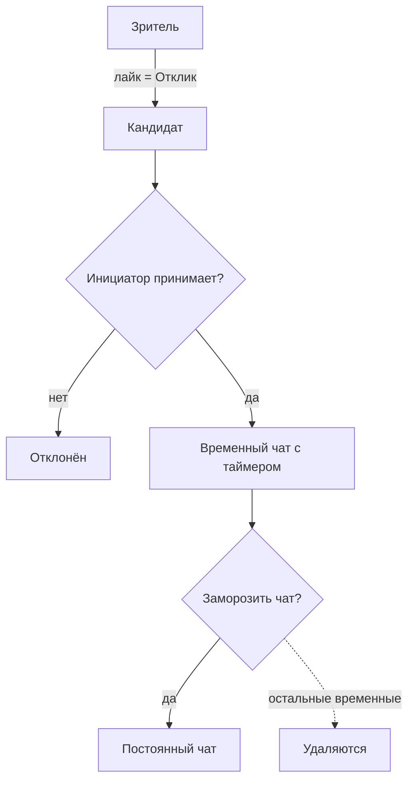

# Логика мэтчинга, анкет и лайков

Прототип продуктовой логики: роли, отклики, временные/постоянные чаты, жизненный цикл анкеты. Точные числа и монетизация намеренно отложены — см. «Отложено».

## Роли (контекстные ярлыки, не сущности и не поля)

Роль — это **не свойство профиля** и не отдельная сущность. Это контекстный ярлык, который профиль получает по своей **связи с конкретной анкетой** (`MeetingAd`):

- **Автор** (Инициатор) — профиль, владеющий активной анкетой (`MeetingAd.authorProfileId`); получает отклики.
- **Кандидат** (Зритель) — профиль, откликнувшийся на чужую анкету (запись `MeetingCandidate`); листает анкеты и откликается.

Один и тот же профиль одновременно может быть автором своей анкеты и кандидатом на чужих — роль определяется связью, а не самим профилем. Поэтому никакого поля `role` на профиле и отдельной сущности `MeetingAuthor` нет: авторство полностью выражается полем `MeetingAd.authorProfileId`.

## Сущности

- **Анкета** (`MeetingAd`) — намерение встретиться: описание встречи + теги встречи. `authorProfileId` — профиль-автор. **Одна активная на юзера.**
- **Кандидат** (`MeetingCandidate`) — отклик профиля на анкету: `{ meetingAdId, profileId, status }`, где `status` = `pending` (лайкнул) / `accepted` (принят) / `rejected` (отклонён). Лайк = создание записи со `status = pending`; отдельной сущности `Like` нет.
- **Match** — состояние «автор принял кандидата» (`MeetingCandidate.status = accepted`), на котором открывается чат. Отдельной таблицей не выделяем, пока нет своих данных помимо чата.
- **Чат** — открывается на Match. Бывает:
    - **временный** — с таймером встречи (живёт ограниченно);
    - **постоянный** — таймер «заморожен», живёт дальше.

## Поток

Матч **асимметричный**: Зритель лайкает, Инициатор **принимает** (он хозяин встречи). Взаимный лайк не требуется.

## Временные чаты и заморозка (ядро механики)

- Лайков можно отправить/принять **несколько** → несколько **временных** чатов (с таймером), идут параллельно.
- Когда юзер **замораживает** один чат (выключает таймер = делает постоянным) — **остальные временные чаты удаляются**.
- Итог на фри-тарифе: **1 постоянный чат за цикл**.
- **Premium**: заморозить **несколько** чатов (остальные не удаляются).

«Моногамия» — это лимит на **один цикл/анкету**, а не глобально.

### Старт таймера — по первому сообщению обоих

Таймер **не стартует** в момент матча. Он запускается, когда оба участника отправили хотя бы по одному сообщению.

Кейс: Инициатор принял лайк, Кандидат оффлайн 30 минут — таймер на 20 минут ещё не идёт. Инициатор написал «Привет» → таймер всё ещё стоит. Кандидат вернулся, написал «Привет» → таймер пошёл.

### Истёкший чат

Когда таймер доходит до нуля, чат переходит в состояние **«истёк»**:

- История переписки **сохраняется** и доступна для чтения.
- Писать новые сообщения **нельзя**.
- Единственное доступное действие — **запросить остановку таймера** (заморозку = перевод в постоянный).

### Заморозка по взаимному согласию

Заморозку можно запросить как **до** истечения таймера, так и **после** (из истёкшего состояния). Требует согласия обоих:

1. Любой из двух (Инициатор или Кандидат) нажимает «Остановить таймер».
2. Второму участнику приходит запрос — принять или отклонить.
3. Только после **подтверждения** чат становится постоянным и остальные временные чаты удаляются.
4. Если второй отклонил — таймер продолжает идти (или чат остаётся в истёкшем состоянии).

## Жизненный цикл анкеты

- **Одна активная анкета** на юзера, не более.
- **Живёт N времени** → пропадает (модель «здесь и сейчас»).
- Цикл закрывается, когда юзер заморозил постоянный чат.
- **Пересоздание в один тап**: последняя анкета хранится как шаблон, «Опубликовать снова» подставляет поля → подтверждение. Это **новая анкета с новым `createdAt`** (честно, время намерения не подделываем).

## Накопление чатов

**Постоянные чаты от разных анкет/циклов накапливаются** свободно — иначе мессенджер пустой. Ограничение работает внутри цикла (заморозил 1 → остальные временные удалены), а не на всю историю.

## Таб «Лайки»

- Имеет смысл только при **активной анкете** (инициатор) — входящие Кандидаты: принять / отклонить.
- Нет активной анкеты → пустое состояние + CTA «Создайте анкету, чтобы получать отклики».
- Исходящие лайки в MVP не показываем: лайкнул → приняли → временный чат появился в мессенджере.

## Симметрия табов

- **Поиск** — Зритель листает **анкеты**.
- **Лайки** — Инициатор смотрит **Кандидатов** на свою анкету.
- _(future, после MVP)_ — обратный discovery: Инициатор листает **зрителей/людей** и зовёт в анкету (активный поиск вместо ожидания откликов).

## Фильтры поиска

На табе **Поиск** Зритель отбирает анкеты по критериям: пол автора, возраст, цель знакомства, интересы и т.п. Это **настройки поиска конкретного пользователя, а не поля профиля** — «кого ищу» (`lookingFor` / предпочтения) в профиль не кладём. Профиль отвечает на «кто я», фильтры — на «кого показывать». Конкретный набор фильтров и их API — в разделе контракта по модулю встреч (TBD).

## Premium (бакет на потом, в MVP — заглушка «Скоро»)

Ограничения фри-тарифа — это и есть механика; подписка их **снимает** (нативный пейволл, не искусственный). Реальную оплату в MVP не строим.

- **Заморозить несколько** чатов из одного цикла (параллельные постоянные чаты, остальные не удаляются).
- Больше матчей/временных чатов на анкету.
- «Кто меня лайкнул».
- **Скрыть свои анкеты от конкретного чата** — лёгкое одностороннее «не показывать мои анкеты этому человеку» (снимает трение «а чего ты опять выложил анкету?»). Не путать с жёстким «Заблокировать».

## Отложено (тюнинг после проверки гипотезы)

- **Монетизация/оплата**: App Store IAP (комиссия 30%, РФ-нюансы с картами/RuStore), entitlements, restore, серверная проверка.
- **Кулдаун на пересоздание анкеты** (future-knob против фри-грайнда «матч → пересоздал → матч»): фри — раз в N часов, premium — мгновенно.
- **Ресурфейс/заморозка анкеты** и нужно ли отдельное поле `resurfacedAt` для сортировки (если размороженная анкета должна снова получать видимость).
- **Точные числа**: время жизни анкеты, лимит Кандидатов/временных чатов, длительность таймера чата.
